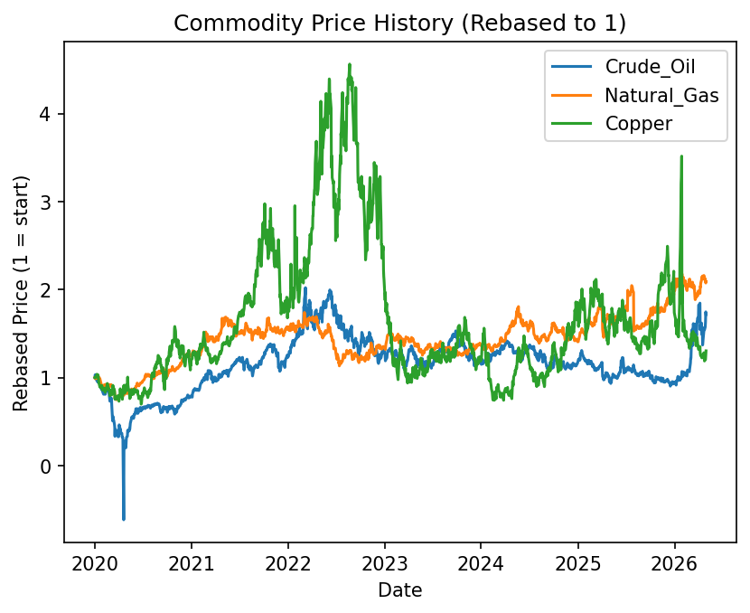
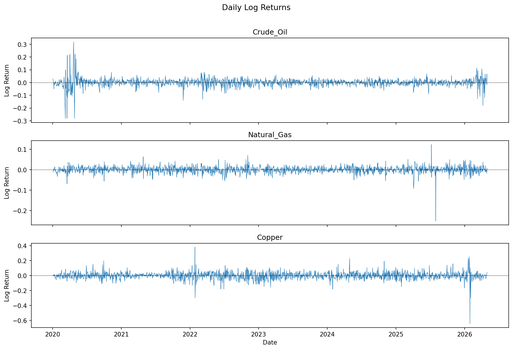
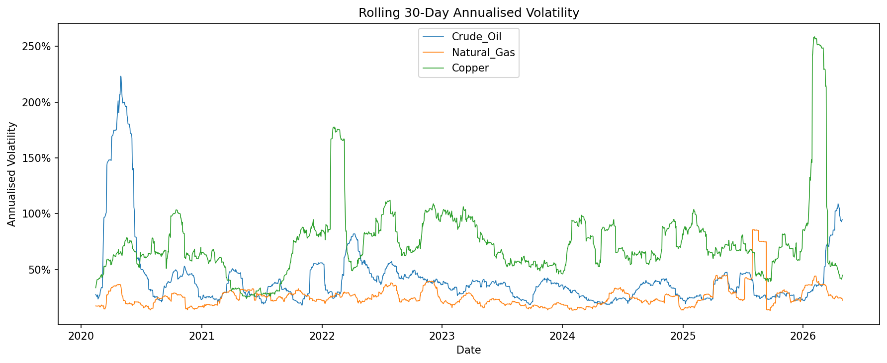
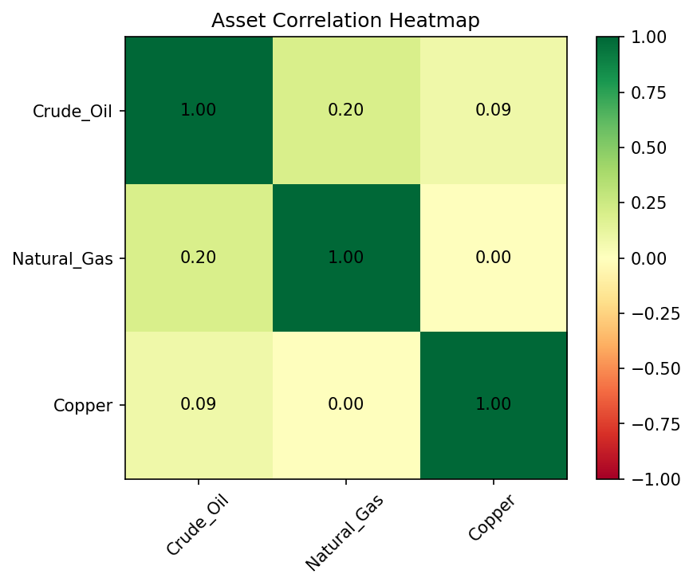
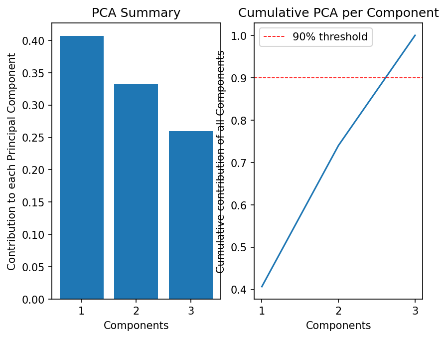

# Commodity Price Analytics Dashboard

> Quantitative analysis of covariance, volatility, and underlying risk 
> factors across crude oil (WTI), natural gas (Henry Hub), and copper 
> futures - covering January 2020 to May 2026.

---

## Overview

This project builds an end-to-end analytical pipeline for three commodity 
futures markets. Starting from raw price data, it produces rebased price 
comparisons, log return distributions, rolling volatility estimates, a 
correlation matrix, and a full PCA decomposition.

The date range is deliberately chosen to span several major market regimes: 
the COVID-19 demand collapse (2020), the post-pandemic commodity supercycle 
(2021), the Russia-Ukraine energy shock (2022),the 2025-26 tariff 
uncertainty and the Iran-US conflict. 

---

## Mathematical Methods

**Log Returns**  
Raw prices are transformed into log returns: `r_t = ln(P_t / P_{t-1})`.  
Log returns are used rather than simple returns because they are additive 
across time, the multi-period return is simply the sum of single-period 
log returns. They also produce a non-negative, more symmetric distribution, which is a 
prerequisite for many downstream statistical models.

**Rolling Volatility**  
Annualised volatility is estimated as the rolling 30-day standard deviation 
of log returns, scaled by `sqrt(252)`. The square-root-of-time scaling 
follows from the variance of i.i.d. returns scaling linearly with time, 
so standard deviation scales with the square root. This captures 
time-varying volatility clustering - the caveat of the i.i.d. implementation
is that volatility clusters in reality.

**Correlation Matrix**  
The Pearson correlation matrix `ρ_ij = Cov(r_i, r_j) / (σ_i · σ_j)` 
measures linear co-movement between asset pairs, normalised to [-1, 1]. 
The resulting matrix is always symmetric and positive semi-definite,
all eigenvalues are non-negative, which is a necessary condition for 
it to represent a valid covariance structure.

**Principal Component Analysis**  
PCA is implemented from scratch using NumPy eigendecomposition, no 
sklearn. The covariance matrix of standardised returns is decomposed as 
`Σ = V D V^T`, where the columns of V are eigenvectors (principal 
components) and the diagonal of D contains eigenvalues (variance 
explained per component). The data is then projected onto the top k 
eigenvectors, reducing dimensionality while retaining the dominant 
sources of co-movement. In commodity markets, PC1 typically represents 
a broad macro risk factor driving all three assets simultaneously.

---

## Results & Market Interpretation

### Rebased Price History (2020–2026)



All three series are rebased to 1.0 at January 2020 to allow direct 
comparison of relative performance across assets trading at incomparable 
price levels.

**Crude Oil (WTI)** experienced the most dramatic single event of the 
period in March–April 2020, when a simultaneous demand collapse from 
COVID-19 lockdowns and an OPEC+ price war between Saudi Arabia and Russia 
caused WTI futures to briefly trade negative (-$37/bbl) — historically 
unprecedented. Prices recovered steadily through 2021 as vaccination 
rollouts restored mobility demand, before spiking sharply in early 2022 
when Russia's invasion of Ukraine triggered a global energy security 
repricing. Volatility remained elevated throughout 2022–23 as OPEC+ 
production cuts fought against demand destruction fears. A modest 
tariff-driven risk premium emerged in 2024–25, before the most recent 
spike in 2026 following the US-Iran conflict and the closure of the 
Strait of Hormuz — a chokepoint carrying approximately 20% of global 
seaborne oil supply. Unlike previous geopolitical spikes, markets are 
pricing this move as persistent rather than transitory, reflecting fears 
of permanent infrastructure damage to Middle Eastern production capacity.

**Natural Gas (Henry Hub)** showed negligible response to the 2020 
pandemic — in contrast to oil, gas demand is dominated by residential 
heating, power generation, and industrial processes that continued 
largely uninterrupted through lockdowns, with work-from-home actually 
increasing residential consumption. The defining event for natural gas 
was the 2022 Russia-Ukraine war, which triggered a structural 
transformation of the global LNG market. Russia had supplied 
approximately 40% of European gas via pipeline; as sanctions severed 
those flows, European buyers urgently competed for LNG cargoes from 
the US, Qatar, and Australia — pulling Henry Hub prices sharply higher 
as export terminal capacity became a binding constraint. This represents 
a regime change: US natural gas, historically a regional market, became 
globally priced almost overnight. Volatility has remained elevated since, 
driven by European storage dynamics, weather-sensitive demand, and 
ongoing geopolitical tail risks now amplified by the Iran conflict.

**Copper** is the global growth barometer — its price reflects 
expectations for construction, manufacturing, electric vehicle 
production, and power grid infrastructure. The sharp 2020 trough 
reflects China growth fears at the onset of COVID; the rapid recovery 
reflects China's economy reopening first and deploying large-scale 
infrastructure stimulus. The sustained multi-year rally through 2021–24 
is driven by two structural forces: the post-pandemic construction boom 
and the accelerating global energy transition, which requires 
approximately 4× more copper per unit of generating capacity in wind 
and solar versus conventional power. Supply-side constraints — labour 
strikes and declining ore grades at major Chilean and Peruvian mines — 
have reinforced the price floor. The apparent scale of copper's move 
relative to the other two assets on the rebased chart is partly a base 
effect: the starting point of January 2020 captured near-cycle lows.

---

### Log Returns



Log returns `r_t = ln(P_t / P_{t-1})` are computed in preference to 
simple returns for their additive property across time and more 
symmetric distribution. Each series is plotted on an independent axis 
to prevent scale distortion across assets with different volatility 
profiles.

The charts exhibit **volatility clustering** — the defining stylised 
fact of financial time series. Large return days cluster together: the 
COVID shock of March 2020, the Russia-Ukraine escalation of February 
2022, and the 2026 Iran conflict each produced sustained regimes of 
elevated daily moves rather than isolated spikes. This empirical 
observation is the direct motivation for GARCH modelling (see Project 4 
— Crack Spread Analyser), which explicitly models the dependence of 
today's variance on yesterday's variance. Under the i.i.d. assumption 
implicit in simple volatility estimates, this clustering is invisible.

---

### Rolling 30-Day Annualised Volatility



Annualised volatility is estimated as the rolling 30-day standard 
deviation of log returns, scaled by `√252`. The square-root-of-time 
scaling follows from variance scaling linearly with time under i.i.d. 
returns — daily variance multiplied by 252 trading days gives annual 
variance, so annual standard deviation = daily standard deviation × √252. 
In practice, returns are not i.i.d. (volatility clusters), making this 
a useful approximation rather than a precise measure.

Three distinct volatility regimes are visible across all assets: the 
COVID shock (March 2020), the Russia-Ukraine energy crisis (2022), and 
the Iran conflict (2026). The synchronisation of volatility spikes 
across crude oil, natural gas, and copper during these events is direct 
evidence of a common macro risk factor — the same factor that PC1 
captures in the PCA decomposition below.

---

### Correlation Matrix



The Pearson correlation matrix `ρ_ij = Cov(r_i, r_j) / (σ_i · σ_j)` 
measures linear co-movement between asset pairs over the full 2020–2026 
sample. The matrix is symmetric by construction and positive 
semi-definite — all eigenvalues are non-negative, a necessary condition 
for a valid covariance structure.

The strongest correlation is between crude oil and natural gas, 
reflecting their shared exposure to energy demand cycles, geopolitical 
supply risks, and the structural linkage created when the LNG market 
globalised in 2022. Copper shows positive but weaker correlation with 
both energy commodities — it shares the macro risk-on/risk-off factor 
but is driven by distinct supply chains and a different demand base 
(industrial and green infrastructure rather than energy consumption). 
The imperfect correlations confirm that diversification across these 
three assets provides meaningful risk reduction relative to holding 
a single commodity — though correlation tends to rise sharply during 
crisis periods, precisely when diversification is most needed.

---

### Principal Component Analysis



PCA is implemented from scratch using NumPy eigendecomposition — no 
sklearn. The covariance matrix of standardised returns is decomposed as 
`Σ = VDVᵀ`, where columns of V are eigenvectors (principal components) 
and the diagonal of D contains eigenvalues (variance explained per 
component).

PC1 explains the majority of total variance across all three commodities, 
confirming that a single dominant macro factor — global risk appetite, 
dollar strength, or broad commodity demand — drives synchronised 
co-movement across energy and metals markets. This is consistent with 
the volatility clustering observed above: the same macro shocks 
(COVID, Russia-Ukraine, Iran) that caused simultaneous volatility 
spikes also drive the high PC1 loading. PC2 captures the energy-specific 
component, separating the crude oil and natural gas complex from copper 
and reflecting the divergent supply dynamics of 2022 — a year in which 
energy prices were driven by geopolitical supply disruption while copper 
responded to Chinese demand signals. PC3 represents residual 
asset-specific noise unexplained by common factors.

The practical implication for a commodity derivatives desk: a trader 
hedging a portfolio of these three assets need not hedge each 
independently. A macro hedge addressing PC1 — perhaps via a broad 
commodity index or dollar position — neutralises the dominant source 
of risk. Residual exposure to PC2 and PC3 can then be managed with 
asset-specific instruments.

---
## Project Structure

```
commodity-price-dashboard/
├── src/
│   ├── data_loader.py      # Price fetching and caching via yfinance
│   ├── analytics.py        # Mathematical transformations (returns, vol, PCA)
│   └── visualisation.py    # Chart generation via matplotlib
├── notebooks/
│   └── 01_exploration.ipynb  # End-to-end analysis pipeline
├── tests/
│   └── test_analytics.py   # Unit tests for analytical functions
└── requirements.txt
```

---

## How to Run

```bash
git clone https://github.com/addzzz786/commodity-price-dashboard.git
cd commodity-price-dashboard
python -m venv venv
venv\Scripts\Activate.ps1      # Windows
pip install -r requirements.txt
jupyter notebook notebooks/01_exploration.ipynb
```

---

## Dependencies

- `numpy` — matrix operations and eigendecomposition  
- `pandas` — time series data structures  
- `matplotlib` — visualisation  
- `yfinance` — commodity futures price data  
- `scipy` — statistical functions

